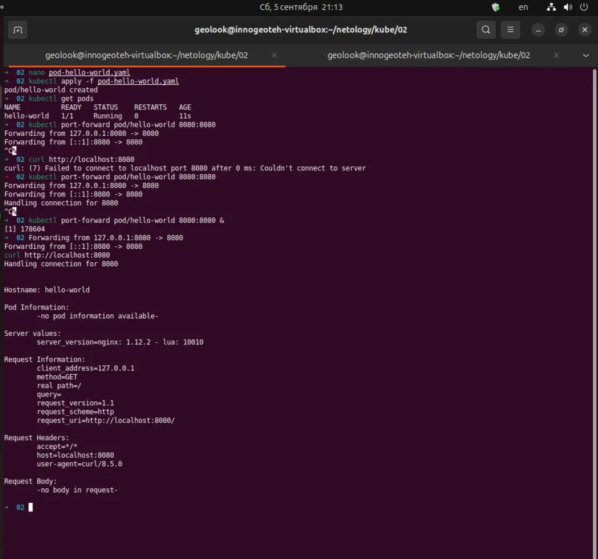
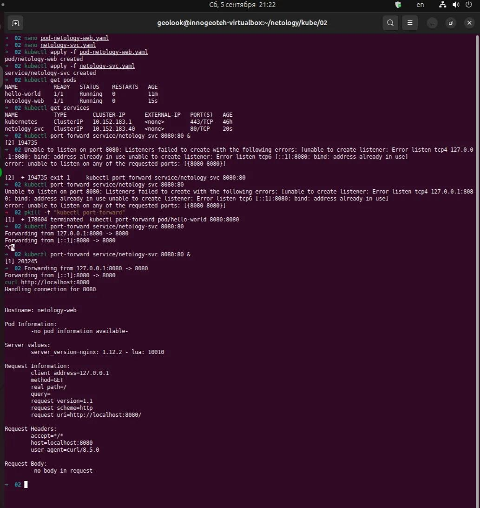

# Практическое задание с самопроверкой «Базовые объекты K8S»

Это задание для самостоятельной работы — оно не будет проверяться экспертом.

#### Почему его важно и полезно выполнить:
Загрузив своё решение в личный кабинет, вы получите пример выполненной работы.

Сколько бы теории вы ни изучали, мастерство приходит только с практикой. Не научившись решать простые задачи, вы будете испытывать всё больше затруднений при переходе к более сложным.

Инструкция «Как переводить иностранную документацию»

### Цель задания
В тестовой среде для работы с Kubernetes, установленной в предыдущем ДЗ, необходимо развернуть Pod с приложением и подключиться к нему со своего локального компьютера.

### Чеклист готовности к домашнему заданию
1. Установленное k8s-решение (например, MicroK8S).
2. Установленный локальный kubectl.
3. Редактор YAML-файлов с подключенным Git-репозиторием.

### Инструменты и дополнительные материалы, которые пригодятся для выполнения задания
1. Описание Pod и примеры манифестов.
2. Описание Service.

### Задание 1. Создать Pod с именем hello-world
1. Создать манифест (yaml-конфигурацию) Pod.
2. Использовать image - gcr.io/kubernetes-e2e-test-images/echoserver:2.2.
3. Подключиться локально к Pod с помощью kubectl port-forward и вывести значение (curl или в браузере).

### Задание 2. Создать Service и подключить его к Pod
1. Создать Pod с именем netology-web.
2. Использовать image — gcr.io/kubernetes-e2e-test-images/echoserver:2.2.
3. Создать Service с именем netology-svc и подключить к netology-web.
4. Подключиться локально к Service с помощью kubectl port-forward и вывести значение (curl или в браузере).

### Правила приёма работы
1. Домашняя работа оформляется в своем Git-репозитории в файле README.md. Выполненное домашнее задание пришлите ссылкой на .md-файл в вашем репозитории.
2. Файл README.md должен содержать скриншоты вывода команд kubectl get pods, а также скриншот результата подключения.
3. Репозиторий должен содержать файлы манифестов и ссылки на них в файле README.md.

#### Правила приема работ

После загрузки вашего ответа вы получите пример выполненного задания. Вы можете задать свой вопрос в личном кабинете под самим заданием.

---
---

# Домашнее задание: Pod и Service в Kubernetes

## Выполненные шаги

### Задание 1. Pod `hello-world`
- Создан манифест `pod-hello-world.yaml` для Pod с образом `gcr.io/kubernetes-e2e-test-images/echoserver:2.2`.
- Манифест применён в кластере (`kubectl apply -f pod-hello-world.yaml`).
- Pod успешно запущен (статус `Running`).
- Выполнен проброс порта (`kubectl port-forward pod/hello-world 8080:8080`) и проверена доступность через `curl http://localhost:8080` - получен ответ от сервера.

### Задание 2. Service `netology-svc`
- Создан манифест `pod-netology-web.yaml` для Pod с меткой `app: netology-web`.
- Создан манифест `netology-svc.yaml` для Service, который выбирает Pod по метке `app: netology-web`.
- Оба манифеста применены (`kubectl apply -f pod-netology-web.yaml` и `kubectl apply -f netology-svc.yaml`).
- Проверено создание объектов (`kubectl get pods`, `kubectl get services`).
- Выполнен проброс порта к Service (`kubectl port-forward service/netology-svc 8080:80`) и проверка через `curl http://localhost:8080` - получен аналогичный ответ.

## Результаты (скриншоты)
- Вывод `kubectl get pods` - оба Pod в статусе `Running`.  
  
- Вывод `kubectl get services` - Service `netology-svc` создан.  
  
- Ответ `curl` для первого задания (Pod).  
  
- Ответ `curl` для второго задания (Service).  
  

## Файлы манифестов
- [pod-hello-world.yaml](pod-hello-world.yaml)
- [pod-netology-web.yaml](pod-netology-web.yaml)
- [netology-svc.yaml](netology-svc.yaml)

---

**Вывод:** оба задания выполнены, подключение к приложению через Pod и через Service работает корректно.
