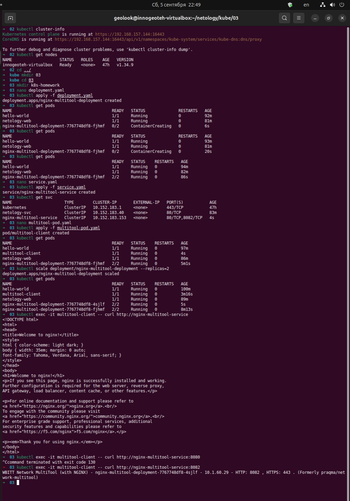
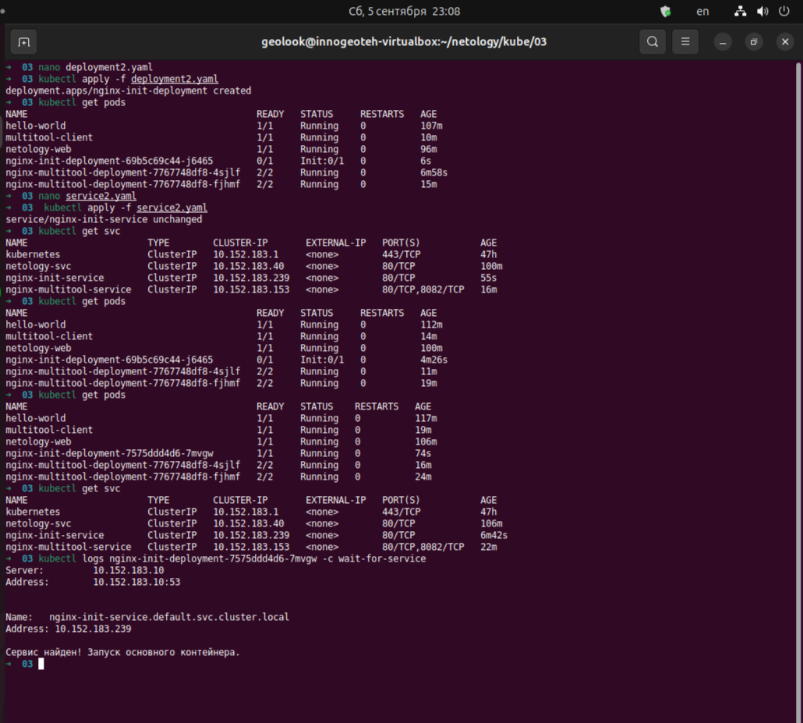

# Домашнее задание к занятию «Запуск приложений в K8S»

### Цель задания

В тестовой среде для работы с Kubernetes, установленной в предыдущем ДЗ, необходимо развернуть Deployment с приложением, состоящим из нескольких контейнеров, и масштабировать его.

------

### Чеклист готовности к домашнему заданию

1. Установленное k8s-решение (например, MicroK8S).
2. Установленный локальный kubectl.
3. Редактор YAML-файлов с подключённым git-репозиторием.

------

### Инструменты и дополнительные материалы, которые пригодятся для выполнения задания

1. [Описание](https://kubernetes.io/docs/concepts/workloads/controllers/deployment/) Deployment и примеры манифестов.
2. [Описание](https://kubernetes.io/docs/concepts/workloads/pods/init-containers/) Init-контейнеров.
3. [Описание](https://github.com/wbitt/Network-MultiTool) Multitool.

------

### Задание 1. Создать Deployment и обеспечить доступ к репликам приложения из другого Pod

1. Создать Deployment приложения, состоящего из двух контейнеров — nginx и multitool. Решить возникшую ошибку.
2. После запуска увеличить количество реплик работающего приложения до 2.
3. Продемонстрировать количество подов до и после масштабирования.
4. Создать Service, который обеспечит доступ до реплик приложений из п.1.
5. Создать отдельный Pod с приложением multitool и убедиться с помощью `curl`, что из пода есть доступ до приложений из п.1.

------

### Задание 2. Создать Deployment и обеспечить старт основного контейнера при выполнении условий

1. Создать Deployment приложения nginx и обеспечить старт контейнера только после того, как будет запущен сервис этого приложения.
2. Убедиться, что nginx не стартует. В качестве Init-контейнера взять busybox.
3. Создать и запустить Service. Убедиться, что Init запустился.
4. Продемонстрировать состояние пода до и после запуска сервиса.

------

### Правила приема работы

1. Домашняя работа оформляется в своем Git-репозитории в файле README.md. Выполненное домашнее задание пришлите ссылкой на .md-файл в вашем репозитории.
2. Файл README.md должен содержать скриншоты вывода необходимых команд `kubectl` и скриншоты результатов.
3. Репозиторий должен содержать файлы манифестов и ссылки на них в файле README.md.

------
------

# Выполнение домашнего задания "Запуск приложений в K8S"

---

## Задание 1. Deployment с nginx и multitool + доступ из другого Pod

### 1.1 Создание Deployment
```bash
kubectl apply -f deployment.yaml
kubectl get pods
```

### 1.2 Масштабирование до 2 реплик
```bash
kubectl scale deployment/nginx-multitool-deployment --replicas=2
kubectl get pods
```

### 1.3 Создание Service
```bash
kubectl apply -f service.yaml
kubectl get svc
```

### 1.4 Проверка доступа из отдельного Pod
```bash
kubectl apply -f multitool-pod.yaml
```
Доступ к nginx:  
```bash
kubectl exec -it multitool-client -- curl http://nginx-multitool-service
```
Доступ к multitool:  
```bash
kubectl exec -it multitool-client -- curl http://nginx-multitool-service:8082
```



## Задание 2. Deployment с Init-контейнером

### 2.1 Первоначальный Deployment (без Service)
```bash
kubectl apply -f deployment2.yaml
kubectl get pods
```

### 2.2 Создание Service
```bash
kubectl apply -f service2.yaml
kubectl get svc
```
После создания Service Pod оставался в Init:0/1 из‑за того, что nslookup в busybox не обрабатывал короткое имя корректно.  

### 2.3 Исправление манифеста
В deployment2.yaml команда Init-контейнера изменена на использование полного доменного имени
nginx-init-service.default.svc.cluster.local.  

```bash
kubectl delete deployment nginx-init-deployment
kubectl apply -f deployment2.yaml
```

### 2.4 Проверка запуска основного контейнера
```bash
kubectl get pods
```

Логи Init-контейнера нового Pod:  
```bash
kubectl logs nginx-init-deployment-7575ddd4d6-7mvgw -c wait-for-service
```



