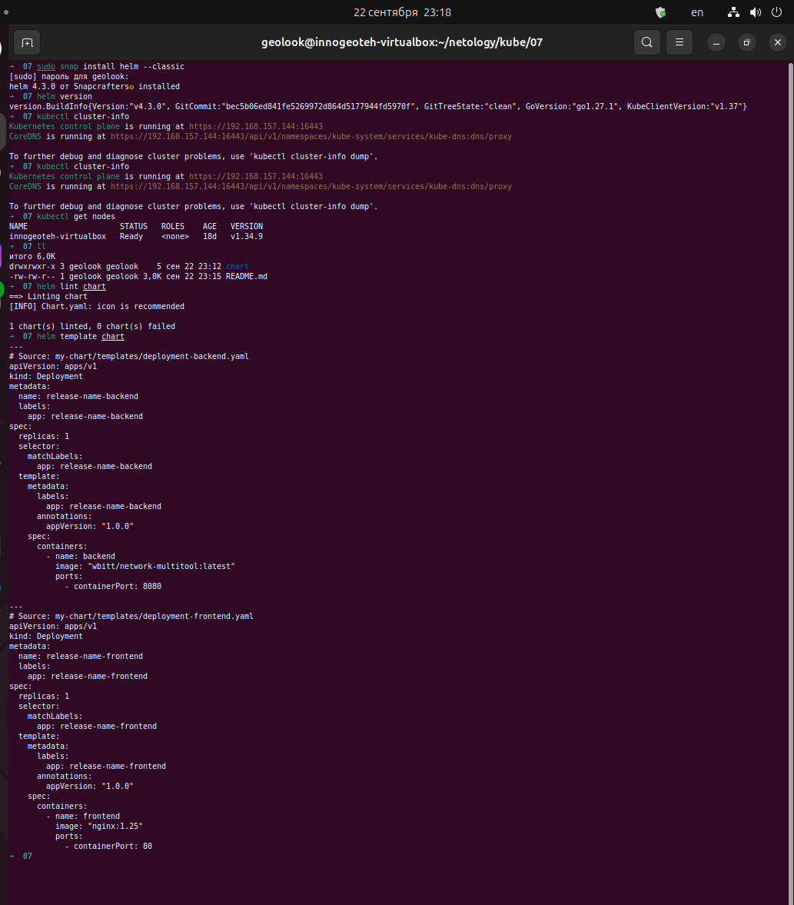
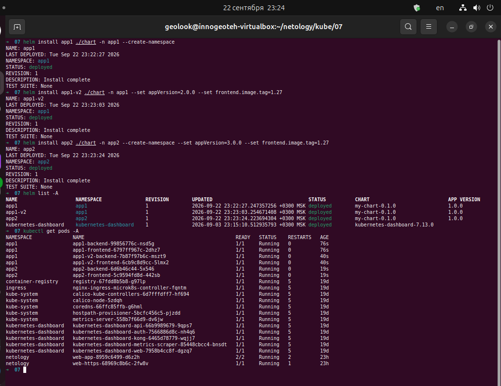
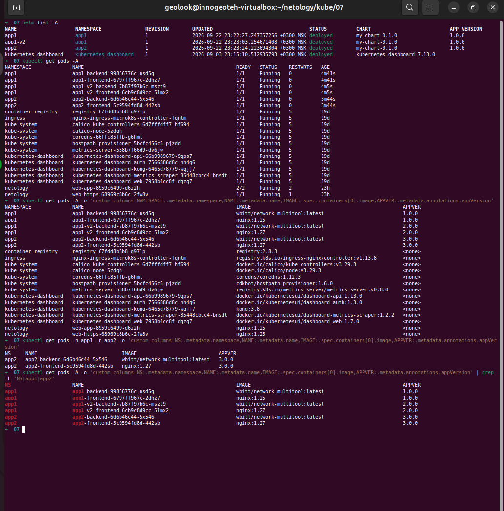

# Домашнее задание к занятию «Helm»

### Цель задания

В тестовой среде Kubernetes необходимо установить и обновить приложения с помощью Helm.

------

### Чеклист готовности к домашнему заданию

1. Установленное k8s-решение, например, MicroK8S.
2. Установленный локальный kubectl.
3. Установленный локальный Helm.
4. Редактор YAML-файлов с подключенным репозиторием GitHub.

------

### Инструменты и дополнительные материалы, которые пригодятся для выполнения задания

1. [Инструкция](https://helm.sh/docs/intro/install/) по установке Helm. [Helm completion](https://helm.sh/docs/helm/helm_completion/).

------

### Задание 1. Подготовить Helm-чарт для приложения

1. Необходимо упаковать приложение в чарт для деплоя в разные окружения. 
2. Каждый компонент приложения деплоится отдельным deployment’ом или statefulset’ом.
3. В переменных чарта измените образ приложения для изменения версии.

------
### Задание 2. Запустить две версии в разных неймспейсах

1. Подготовив чарт, необходимо его проверить. Запуститe несколько копий приложения.
2. Одну версию в namespace=app1, вторую версию в том же неймспейсе, третью версию в namespace=app2.
3. Продемонстрируйте результат.

### Правила приёма работы

1. Домашняя работа оформляется в своём Git репозитории в файле README.md. Выполненное домашнее задание пришлите ссылкой на .md-файл в вашем репозитории.
2. Файл README.md должен содержать скриншоты вывода необходимых команд `kubectl`, `helm`, а также скриншоты результатов.
3. Репозиторий должен содержать тексты манифестов или ссылки на них в файле README.md.

---
---

# Выполнение домашнего задания

## Задание 1. Подготовить Helm-чарт для приложения

Подготовлены `Chart.yaml`, `values.yaml` и `templates` с манифестами для приложения - `deployment-backend.yaml` и `deployment-frontend.yaml`.

  

## Задание 2. Запустить две версии в разных неймспейсах

1. Запуск несколько копий приложения в разных неймспейсах.

```bash
helm install app1 ./chart -n app1 --create-namespace
helm install app1-v2 ./chart -n app1 --set appVersion=2.0.0 --set frontend.image.tag=1.27
helm install app2 ./chart -n app2 --create-namespace --set appVersion=3.0.0 --set frontend.image.tag=1.27
```



2. Проверка версий приложения.

```sh
helm list -A
kubectl get pods -A
kubectl get pods -A -o 'custom-columns=NS:.metadata.namespace,NAME:.metadata.name,IMAGE:.spec.containers[0].image,APPVER:.metadata.annotations.appVersion' | grep -E 'NS|app1|app2'
```



