# Домашнее задание к занятию «Установка Kubernetes»

### Цель задания

Установить кластер K8s.

### Чеклист готовности к домашнему заданию

1. Развёрнутые ВМ с ОС Ubuntu 20.04-lts.


### Инструменты и дополнительные материалы, которые пригодятся для выполнения задания

1. [Инструкция по установке kubeadm](https://kubernetes.io/docs/setup/production-environment/tools/kubeadm/create-cluster-kubeadm/).
2. [Документация kubespray](https://kubespray.io/).

-----

### Задание 1. Установить кластер k8s с 1 master node

1. Подготовка работы кластера из 5 нод: 1 мастер и 4 рабочие ноды.
2. В качестве CRI — containerd.
3. Запуск etcd производить на мастере.
4. Способ установки выбрать самостоятельно.

## Дополнительные задания (со звёздочкой)

**Настоятельно рекомендуем выполнять все задания под звёздочкой.** Их выполнение поможет глубже разобраться в материале.   
Задания под звёздочкой необязательные к выполнению и не повлияют на получение зачёта по этому домашнему заданию. 

------
### Задание 2*. Установить HA кластер

1. Установить кластер в режиме HA.
2. Использовать нечётное количество Master-node.
3. Для cluster ip использовать keepalived или другой способ.

### Правила приёма работы

1. Домашняя работа оформляется в своем Git-репозитории в файле README.md. Выполненное домашнее задание пришлите ссылкой на .md-файл в вашем репозитории.
2. Файл README.md должен содержать скриншоты вывода необходимых команд `kubectl get nodes`, а также скриншоты результатов.
3. Репозиторий должен содержать тексты манифестов или ссылки на них в файле README.md.

---
---

# Выполнение домашнего задания

## Задание 1. Установить кластер k8s с 1 master node

### План

| hostname     | IP              | Роль          |
|--------------|-----------------|---------------|
| k8s-master   | 192.168.157.119 | control plane |
| k8s-worker-1 | 192.168.157.67  | worker        |
| k8s-worker-2 | 192.168.157.50  | worker        |
| k8s-worker-3 | 192.168.157.88  | worker        |
| k8s-worker-4 | 192.168.157.69  | worker        |

### Выполнение

Разворачивание 5 виртуальных машин на VirtualBox: Ubuntu 24.04.5 LTS, режим Bridged Adapter (SSH для удобства работы).

1. Обновление системы

    ```bash
    sudo apt update && sudo apt upgrade -y
    [ -f /var/run/reboot-required ] && sudo reboot
    ```

2. Задание уникальных имён

    ```bash
    sudo hostnamectl set-hostname k8s-master     # 192.168.157.119
    sudo hostnamectl set-hostname k8s-worker-1   # 192.168.157.67
    sudo hostnamectl set-hostname k8s-worker-2   # 192.168.157.50
    sudo hostnamectl set-hostname k8s-worker-3   # 192.168.157.88
    sudo hostnamectl set-hostname k8s-worker-4   # 192.168.157.69
    ```

3. Проверка уникальности идентификаторов

    ```bash
    sudo cat /sys/class/dmi/id/product_uuid
    ip link | grep -E "link/ether"
    ```

4. /etc/hosts (одинаковый на всех 5 нодах)

    ```bash
    sudo tee -a /etc/hosts > /dev/null <<'EOF'
    192.168.157.119 k8s-master
    192.168.157.67 k8s-worker-1
    192.168.157.50 k8s-worker-2
    192.168.157.88 k8s-worker-3
    192.168.157.69 k8s-worker-4
    EOF
    ```

5. Проверка видимости хостов пингом

    ```bash
    ping -c1 k8s-worker-1
    ping -c1 k8s-worker-2
    ping -c1 k8s-worker-3
    ping -c1 k8s-worker-4
    ```

    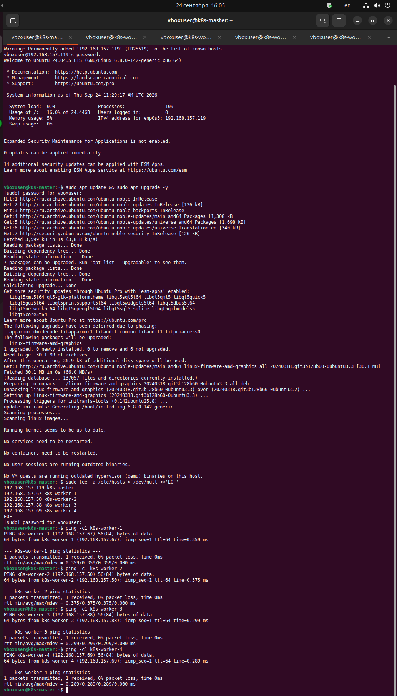

6. Модули ядра и sysctl (на всех 5 нодах)

    ```bash
    cat <<EOF | sudo tee /etc/modules-load.d/k8s.conf
    overlay
    br_netfilter
    EOF
    
    sudo modprobe overlay
    sudo modprobe br_netfilter
    
    cat <<EOF | sudo tee /etc/sysctl.d/k8s.conf
    net.bridge.bridge-nf-call-ip6tables = 1
    net.bridge.bridge-nf-call-iptables  = 1
    net.ipv4.ip_forward                 = 1
    EOF
    
    sudo sysctl --system
    ```

    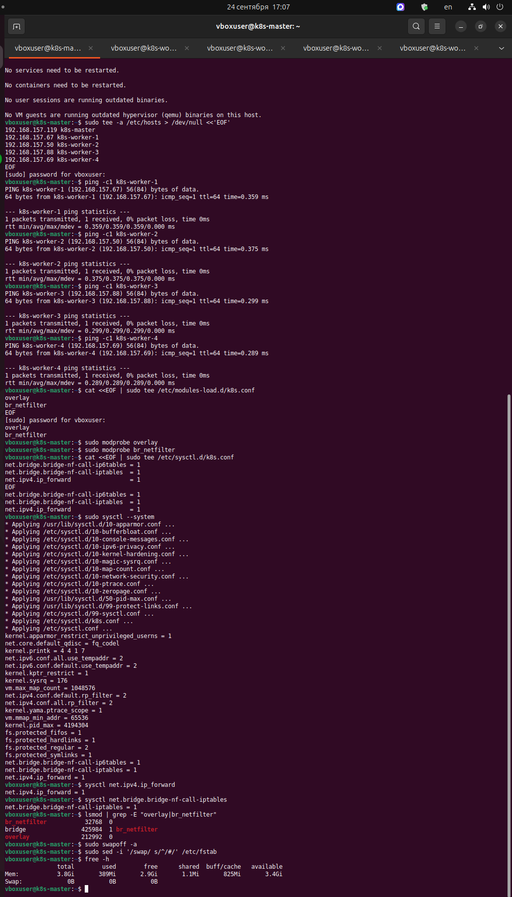

7. Установка докера

    ```bash
    sudo apt update
    sudo apt install -y ca-certificates curl
    
    sudo install -m 0755 -d /etc/apt/keyrings
    sudo curl -fsSL https://download.docker.com/linux/ubuntu/gpg -o /etc/apt/keyrings/docker.asc
    sudo chmod a+r /etc/apt/keyrings/docker.asc
    
    echo "deb [arch=$(dpkg --print-architecture) signed-by=/etc/apt/keyrings/docker.asc] https://download.docker.com/linux/ubuntu $(. /etc/os-release && echo "$VERSION_CODENAME") stable" | sudo tee /etc/apt/sources.list.d/docker.list > /dev/null
    
    sudo apt update
    sudo apt install -y containerd.io

    containerd --version
    
    sudo mkdir -p /etc/containerd
    sudo containerd config default | sudo tee /etc/containerd/config.toml > /dev/null
    sudo sed -i 's/SystemdCgroup = false/SystemdCgroup = true/' /etc/containerd/config.toml

    sudo systemctl restart containerd
    sudo systemctl enable containerd
    ```

    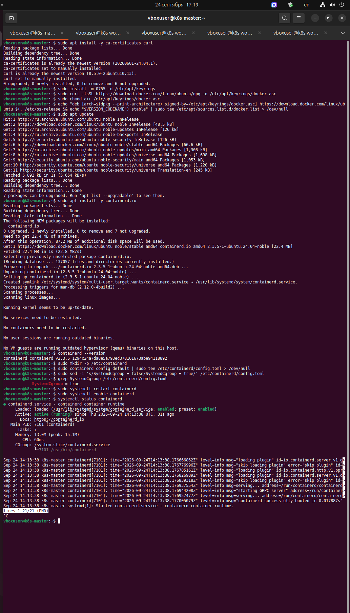

8. Установка kubelet/kubeadm/kubectl (на всех 5 нодах)

    ```bash
    sudo apt-get update
    sudo apt-get install -y apt-transport-https ca-certificates curl gpg

    sudo mkdir -p -m 755 /etc/apt/keyrings
    curl -fsSL https://pkgs.k8s.io/core:/stable:/v1.33/deb/Release.key | sudo gpg --dearmor -o /etc/apt/keyrings/kubernetes-apt-keyring.gpg
    echo 'deb [signed-by=/etc/apt/keyrings/kubernetes-apt-keyring.gpg] https://pkgs.k8s.io/core:/stable:/v1.33/deb/ /' | sudo tee /etc/apt/sources.list.d/kubernetes.list

    sudo apt-get update
    sudo apt-get install -y kubelet kubeadm kubectl
    sudo apt-mark hold kubelet kubeadm kubectl
    sudo systemctl enable --now kubelet
    ```

    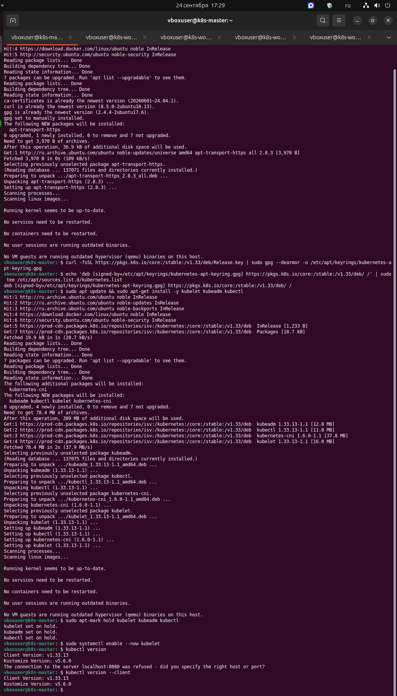

8. Инициализация control plane (только на мастере)

    ```bash
    sudo kubeadm init \
    --apiserver-advertise-address=192.168.157.119 \
    --pod-network-cidr=10.244.0.0/16

    mkdir -p $HOME/.kube
    sudo cp -i /etc/kubernetes/admin.conf $HOME/.kube/config
    sudo chown $(id -u):$(id -g) $HOME/.kube/config

    kubectl get pods -n kube-system -o wide | grep etcd

    kubectl exec -n kube-system etcd-k8s-master -- \
      etcdctl \
        --cacert=/etc/kubernetes/pki/etcd/ca.crt \
        --cert=/etc/kubernetes/pki/etcd/server.crt \
        --key=/etc/kubernetes/pki/etcd/server.key \
        endpoint health

    kubectl apply -f https://github.com/flannel-io/flannel/releases/latest/download/kube-flannel.yml

    kubectl get pods -n kube-flannel
    kubectl get nodes

    kubeadm token create --print-join-command
    ```

    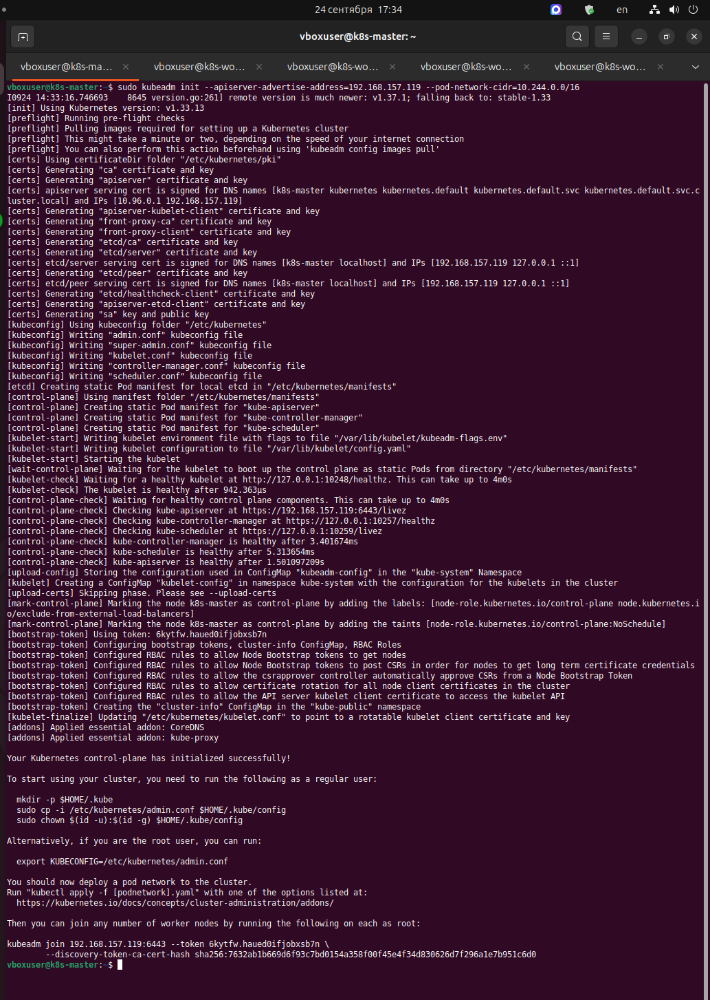  

    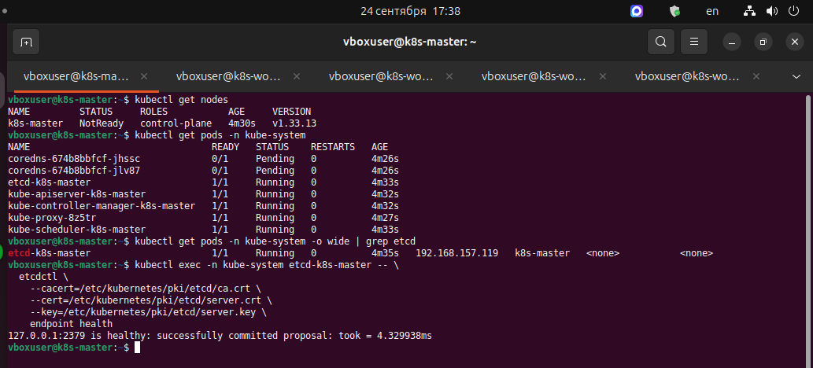  

    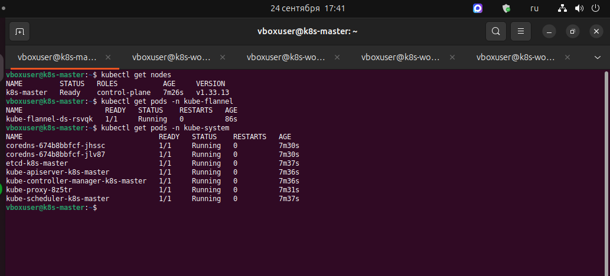  

    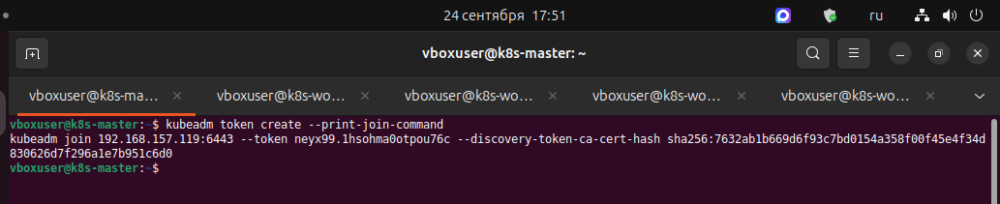  

    Подключение воркеров:

    ```bash
    kubeadm join 192.168.157.119:6443 --token qtnrww.e9jq1i5aexcxe5lg --discovery-token-ca-cert-hash sha256:7632ab1b669d6f93c7bd0154a358f00f45e4f34d830626d7f296a1e7b951c6d0 
    ```

    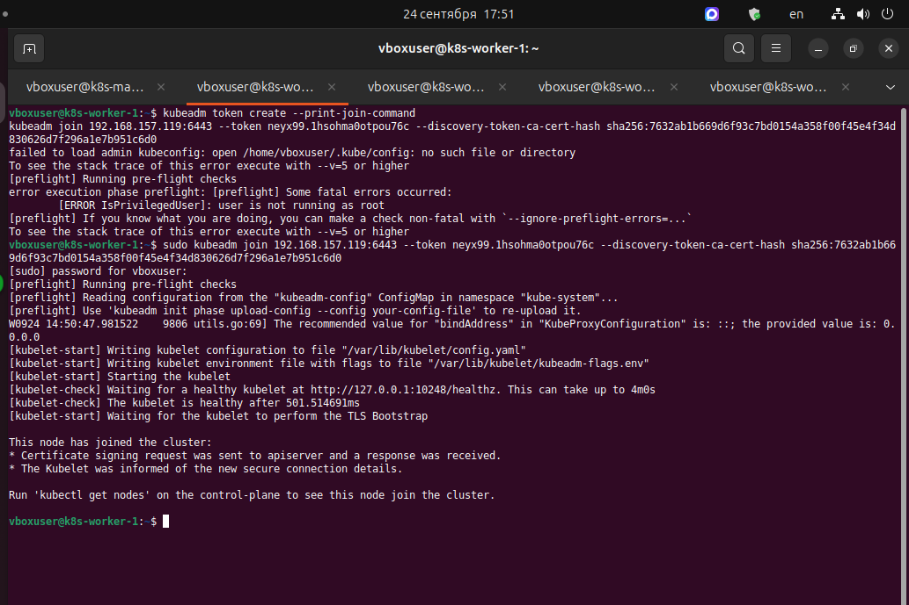  

    Проверка подключения воркеров:

    ```bash
    kubectl get nodes
    kubectl get pods -A -o wide
    ```

    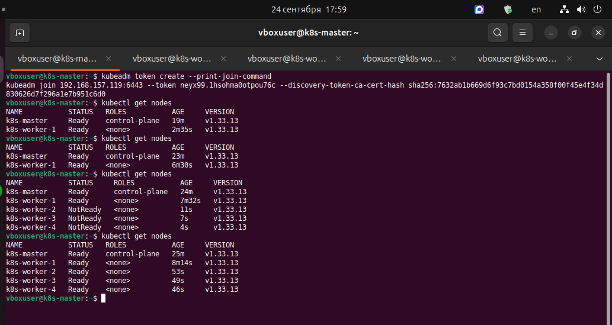  

    Проверка системных подов:

    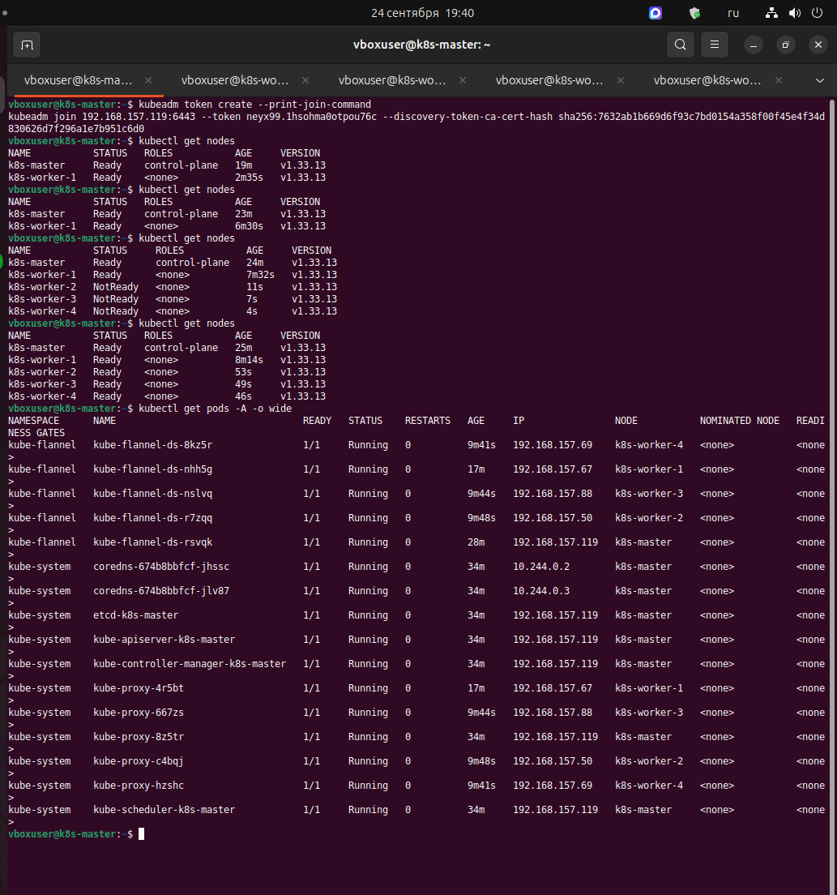  

9. Проверка на тестовом приложении

    ```bash
    kubectl create deployment test-nginx --image=nginx:1.25
    kubectl get pods -o wide
    kubectl scale deployment test-nginx --replicas=6
    kubectl get pods -o wide
    kubectl describe node k8s-master | grep Taints
    kubectl delete deployment test-nginx
    kubectl get pods -o wide
    ```

    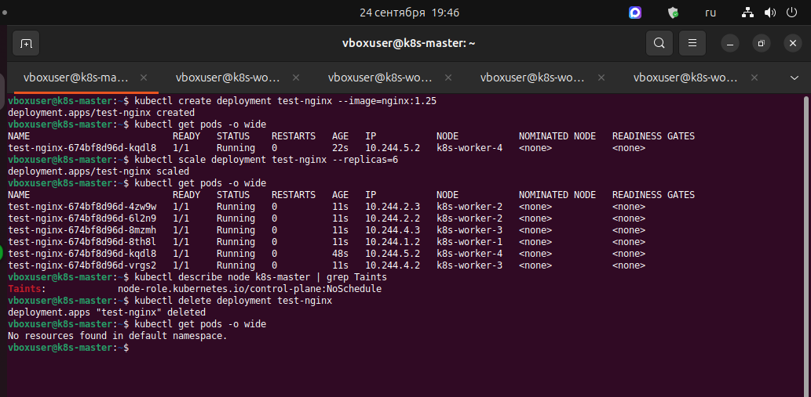  
