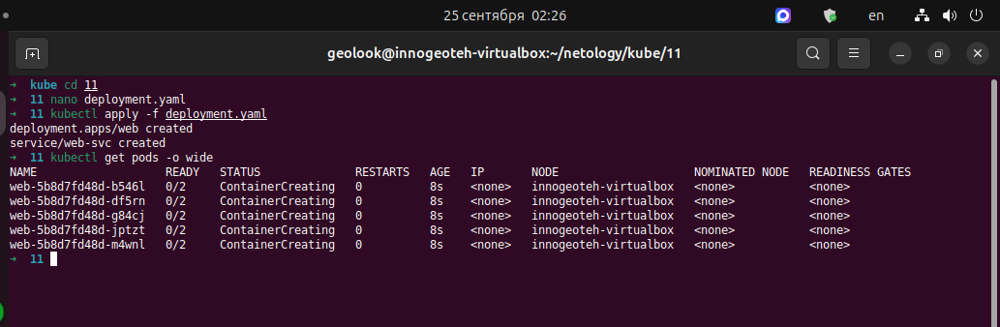
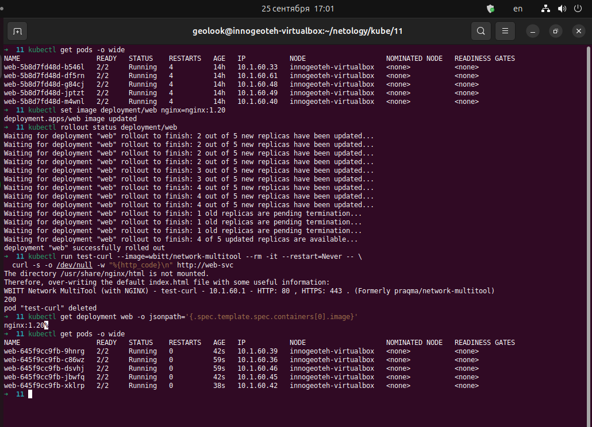
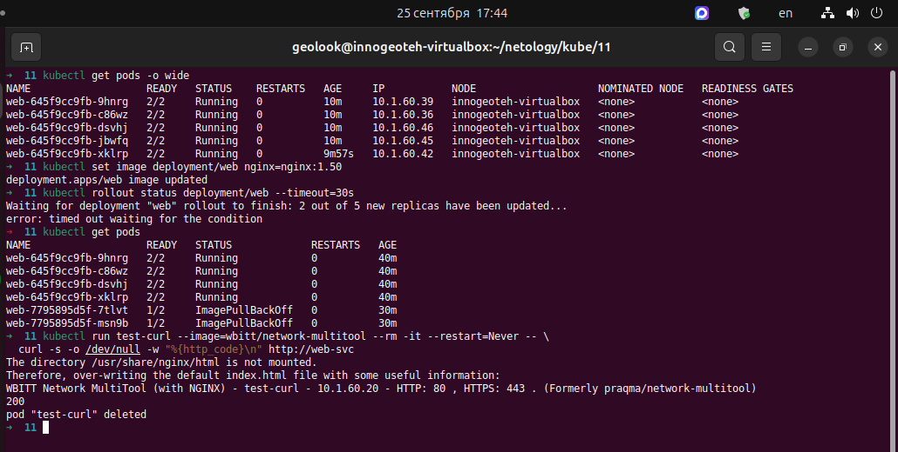
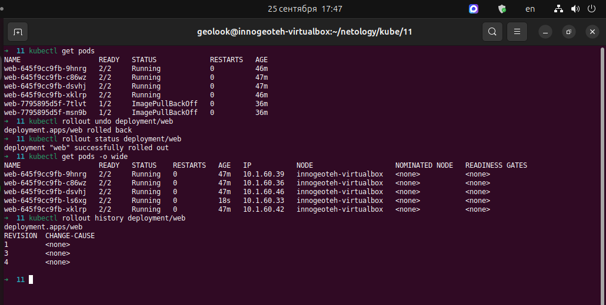

Домашнее задание к занятию «Обновление приложений»
PS со страницы ДЗ портала https://netology.ru/profile/program/shkuber-30/lessons/650299/lesson_items/3523450

Задание
Вопросы по заданию
Преподаватель: Булат Замилов, Марат Гайнутдинов
Цель задания
Уважаемые студенты! В этом задании вам предстоит выбрать и настроить стратегию обновления приложения.

Выполнив это задание, вы:

Научитесь выбирать стратегию обновления приложений с учётом ограниченных ресурсов и совместимости версий.
Освоите практическое обновление Deployment.
Отработаете сценарий с неудачным обновлением на несуществующую версию.
Время на выполнение задания: 240 минут.

Чек-лист готовности к домашнему заданию

Кластер K8s.
Для задания 3* — Ingress-контроллер в кластере (например, Ingress NGINX).
Инструменты и дополнительные материалы, которые пригодятся для выполнения задания

Документация Updating a Deployment.
Статья про стратегии обновлений.
Описание задания
Задание состоит из трёх частей (две обязательные и одна дополнительная).

Задание 1. Выбрать стратегию обновления приложения и описать ваш выбор
Имеется приложение, состоящее из нескольких реплик, которое требуется обновить.
Ресурсы, выделенные для приложения, ограничены, и нет возможности их увеличить.
Запас по ресурсам в менее загруженный момент времени составляет 20%.
Обновление мажорное, новые версии приложения не умеют работать со старыми.
Вам нужно объяснить свой выбор стратегии обновления приложения.
Задание 2. Обновить приложение
Создать Deployment приложения с контейнерами nginx и multitool (образ wbitt/network-multitool). Версию nginx взять 1.19. Количество реплик — 5. Для multitool задайте HTTP_PORT и HTTPS_PORT, отличные от портов nginx, чтобы избежать конфликта.
Обновить версию nginx в приложении до версии 1.20, сократив время обновления до минимума. Приложение должно быть доступно.
Попытаться обновить nginx до заведомо несуществующей версии (например, 1.50); приложение должно оставаться доступным.
Откатиться после неудачного обновления.
Дополнительное задание — со звёздочкой*
Задания дополнительные, необязательные к выполнению, они не повлияют на получение зачёта по домашнему заданию. Но мы настоятельно рекомендуем вам выполнять все задания со звёздочкой. Это поможет лучше разобраться в материале.

Задание 3. Создать Canary deployment*
Создать два Deployment приложения nginx.
При помощи разных ConfigMap сделать две версии приложения — веб-страницы.
С помощью Ingress создать канареечный деплоймент, чтобы можно было часть трафика перебросить на разные версии приложения.
Правила приёма работы

Домашняя работа оформляется в своём Git-репозитории в файле README.md. Выполненное домашнее задание пришлите ссылкой на README.md в вашем репозитории.
Файл README.md должен содержать скриншоты вывода необходимых команд, а также скриншоты результатов.
Репозиторий должен содержать тексты манифестов или ссылки на них в файле README.md.
Вставьте ссылку на вашу работу в поле «Ссылка на решение» и нажмите «Отправить на проверку». Перед отправкой задания вы можете написать комментарий эксперту.

Критерии оценки задания:
«Зачёт» ставится, если:

выполнены обязательные задания 1 и 2;
ответы даны в развёрнутой форме;
приложены скриншоты вывода необходимых команд и результатов;
в репозитории есть тексты манифестов или ссылки на них;
в выполненных заданиях нет противоречий и нарушения логики.
«На доработку» работу отправят, если:

задание выполнено частично или не выполнено;
отсутствуют скриншоты, манифесты или развёрнутые ответы;
в логике выполнения заданий есть противоречия и существенные недостатки.
«Незачёт» ставится в крайнем случае, если вы присылаете пустое или недоработанное задание во второй раз после отправки работы на доработку.

---
---

# Выполнение домашнего задания

## Задание 1. Выбор стратегии обновления приложения и описание выбора

Приложение состоит из нескольких реплик, ресурсы жёстко ограничены, свободный запас - 20%, обновление мажорное и версии несовместимы.
Просится две стратегии на выбор.

`RollingUpdate` обновляет поды постепенно: создаёт новые, гасит старые, обеспечивая нулевой даунтайм.
Но при мажорном обновлении старые и новые поды работают одновременно - а версии несовместимы (например, старая и новая схема API, разные форматы данных, разные версии протокола).
Плюс `RollingUpdate` требует временно больше ресурсов, чем приложение: с maxSurge: 25% пик вырастет до +25% реплик сверх нормы, а у запас всего 20%.
Стратегия не влезает в ограничения.

`Recreate` сначала удаляет все старые поды, затем создаёт новые.
Ресурсы не растут - пик потребления совпадает с обычным.
Две версии никогда не сосуществуют, что критично при несовместимости.
Минус - короткий простой при обновлении, но требование "нулевой даунтайм" в задаче не стоит.

*Выбор стратегии*:  
методом исключения выбирается Recreate, потому что она единственная совместима с условиями:  
(1) невозможность параллельной работы двух несовместимых версий,
(2) жёсткое ограничение ресурсов (пик не растёт).
Простой при обновлении - приемлемая цена в этих условиях.

## Задание 2. Обновить приложение

[deployment.yaml](deployment.yaml) - Манифест Deployment + Service.

- `nginx:1.19` - ерсия из задания.  
- `HTTP_PORT=8080, HTTPS_PORT=8443` - иначе multitool тоже займёт порт 80 и конфликтует с nginx.  
- `strategy.RollingUpdate` с `maxSurge: 1, maxUnavailable: 1` -  обновляем по одному поду, минимум 4 из 5 реплик всегда живы (для выполнения требования сокращения времени обновления).
- Service web-svc - проверка доступности через curl по имени.

  

Обновление до версии nginx 1.20 и проверка версии:  

  

Имитация неудачного обновления до версии nginx 1.50:  

  

Видны застрявшие в ImagePullBackOff новые поды  
Выполнение отката:  

  

